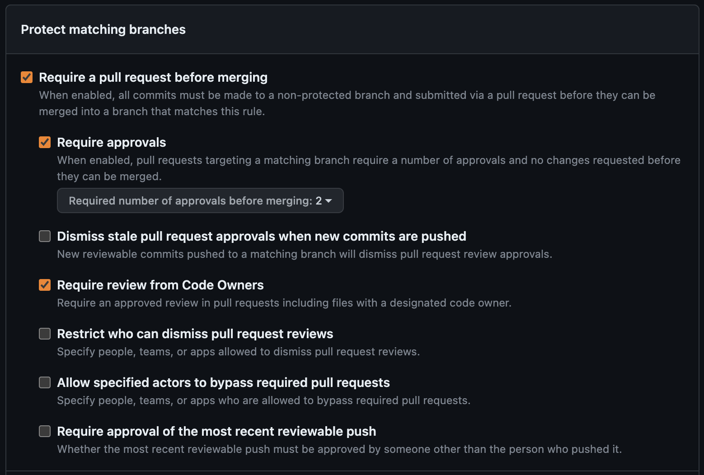
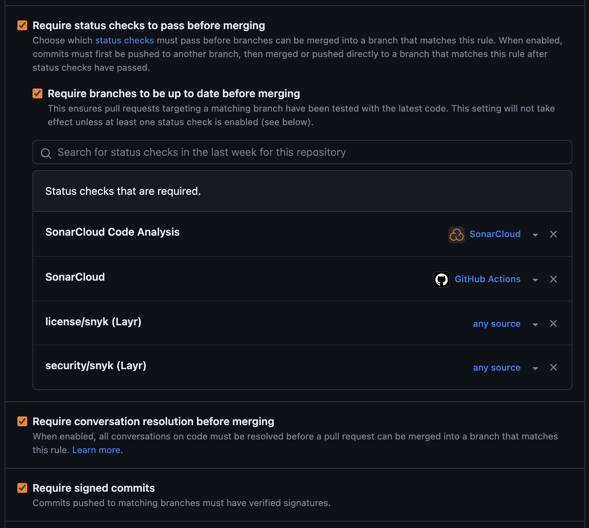
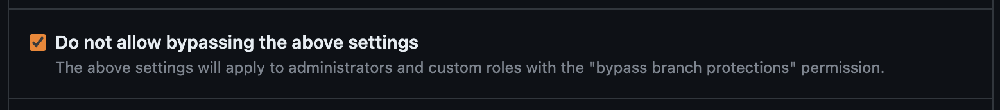

## 🌿 Branch Protection Rules

- Require a pull request before merging.
    - Require approvals (at least 1) 👍.
    - Require review from Code Owners (optional) 👨‍💻.
- Require status checks to pass before merging 🛠️.
    - Require branches to be up to date before merging (mention SonarCloud Analysis 📈, SNYK 🔒).
- Require conversation resolution before merging 💬.
- Require signed commits ✍️.
- Do not allow bypassing the above settings ⛔.

#### Screenshots from GitHub for the same 

